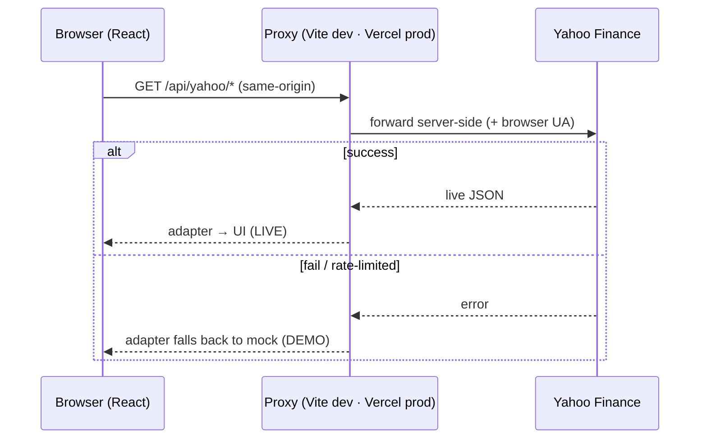

# Stock Dashboard


Built to demonstrate modern **React 19** patterns — Suspense data fetching,
concurrent rendering, and external-store state.

**Live demo:** **[stock-dashboard-ten-opal.vercel.app](https://stock-dashboard-ten-opal.vercel.app)** · English | [繁體中文](README.zh-TW.md)

---

## Overview

A dashboard of US equities: cards with live prices and sparklines, instant
list filtering, a persisted watchlist, and per-stock detail pages with an
interactive, range-switchable price chart — plus toggleable theme and language.
Market data comes from Yahoo Finance and switches to mock data when unavailable.

## Features

- **Dashboard** — responsive card grid, live price/% change, inline sparklines, instant list filtering, watchlist filter.
- **Stock detail** — live quote (O/H/L, prev close, 52-week range, volume), animated area chart with `1W / 1M / 3M / 1Y` ranges.
- **Watchlist** — star any stock; persisted to `localStorage`, synced across the app.
- **Theming** — dark / light, follows system preference, persisted.
- **Internationalization** — English / 繁體中文 / 简体中文, with locale-aware `Intl` number formatting.

## Engineering highlights

- **Suspense-first data layer.** Fetching uses `useSuspenseQuery` behind a single `Suspense` + `ErrorBoundary`, so feature components read data directly — no `isLoading`/`isError` branching scattered through the UI.
- **Server-state management with TanStack Query.** A single `QueryClient` (one retry, `refetchOnWindowFocus` off) with tiered `staleTime` — 60s by default, 1 hour for daily candles — cached per query parameters to avoid redundant requests.
- **Concurrent UX.** `useDeferredValue` (list filtering) and `useTransition` (chart range) keep input and navigation responsive while heavy renders happen at low priority.
- **Performance at scale.** The card grid stays smooth via `React.memo` (skip unchanged cards on filter) and CSS `content-visibility` (skip offscreen layout/paint).
- **Graceful degradation.** Every network path falls back to deterministic mock data (FNV-1a hash → stable across reloads); the app is fully usable offline.
- **Zero-secret data proxy.** Yahoo Finance has no browser CORS, so all calls route through a same-origin proxy — Vite in dev, a Vercel function in prod — with **no API keys** to expose.
- **Provider-agnostic adapter.** All data access sits behind one module ([src/api/stocks.ts](src/api/stocks.ts)); swapping data sources never touches components.

## React patterns

| Pattern | Where | Role |
|---------|-------|------|
| `useSuspenseQuery` + `Suspense` + `ErrorBoundary` | [hooks/useQuotes.ts](src/hooks/useQuotes.ts), [App.tsx](src/App.tsx) | Suspense data fetching; retry wired via `useQueryErrorResetBoundary`. |
| `useDeferredValue` | [routes/Dashboard.tsx](src/routes/Dashboard.tsx) | Keeps typing responsive while filtering the infinite-scroll list of hundreds of cards; the grid dims until the deferred render catches up. |
| `useTransition` | [routes/StockDetail.tsx](src/routes/StockDetail.tsx) | Range switching keeps the old chart visible (no Suspense flash) with a pending state. |
| `useSyncExternalStore` | [store/watchlistStore.ts](src/store/watchlistStore.ts) | Subscribes React to a `localStorage`-backed store; per-symbol snapshots give granular re-renders. |
| `useId` | [components/PriceChart.tsx](src/components/PriceChart.tsx) | Collision-free id for the chart's SVG gradient across instances. |
| `ref` as a prop | [components/SearchBar.tsx](src/components/SearchBar.tsx) | Press `/` to focus the search box — `ref` passed as a normal prop, no `forwardRef`. |
| Document Metadata | [routes/StockDetail.tsx](src/routes/StockDetail.tsx) | `<title>` rendered in-component, hoisted to `<head>`. |
| `React.memo` + `content-visibility` | [components/KpiCard.tsx](src/components/KpiCard.tsx) | Render performance for the large grid. |

## Architecture



- **Data adapter** — [src/api/stocks.ts](src/api/stocks.ts): `getQuote` / `getCandles` (Yahoo `chart`) and `getSparks` (batched `spark` for the dashboard).
- **Proxy** — Yahoo has no CORS; the browser only talks to its own origin. Dev: [vite.config.ts](vite.config.ts) `server.proxy`. Prod: [api/yahoo.ts](api/yahoo.ts) + [vercel.json](vercel.json) rewrite. No key required.
- **Fallback** — on any failure the adapter returns seeded mock data ([src/data/mockData.ts](src/data/mockData.ts)); the detail page shows a `LIVE` / `DEMO` badge accordingly.

## Tech stack

React 19 · TypeScript · Vite · TanStack Query · Recharts · React Router · react-i18next · axios · Vercel.

## Getting started

```bash
npm install
npm run dev      # http://localhost:5173 — live data via the dev proxy
npm run build    # tsc -b && vite build
npm run preview  # serve the production build
npm run lint     # oxlint
```

## Deployment

Deployed on **Vercel** (auto-detected Vite). The `api/` function and `vercel.json`
(proxy rewrite + SPA fallback) are picked up automatically; **no environment
variables required**.

> Yahoo Finance is an unofficial endpoint and may rate-limit datacenter IPs. If a
> request fails in production the app falls back to mock data (`DEMO` badge).

## Project structure

```
api/yahoo.ts            Vercel serverless proxy to Yahoo
src/
  api/stocks.ts         data adapter (live + mock fallback)
  lib/                  yahooClient · queryClient · Intl formatters
  store/                watchlistStore (useSyncExternalStore source)
  hooks/                useQuotes · useWatchlist · useTheme
  components/           KpiCard · Sparkline · PriceChart · RangeTabs · SearchBar · …
  routes/               Dashboard · StockDetail
  i18n/                 react-i18next (en / zh-TW / zh-CN)
  data/mockData.ts      mock stock universe (10 sectors)
```
