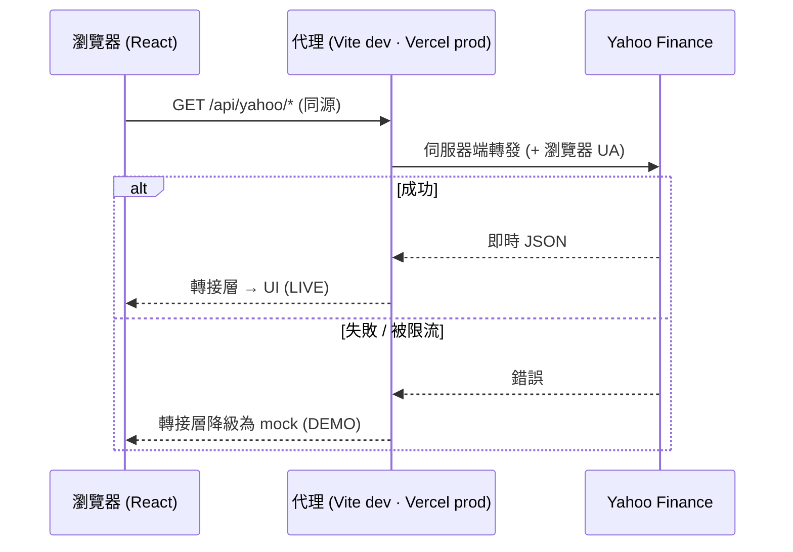

# Stock Dashboard｜股票儀表板


旨在實踐現代 **React 19** 的核心設計模式——Suspense 資料載入、
並行渲染(concurrent rendering)與外部狀態管理(external store)

**線上 Demo:** **[stock-dashboard-ten-opal.vercel.app](https://stock-dashboard-ten-opal.vercel.app)** · [English](README.md) | 繁體中文

---

## 專案簡介

具即時行情與走勢圖的卡片、即時清單過濾、可自選的觀察列表,以及支援時間區間切換的個股走勢圖詳情頁，還有可切換的主題與語言。
股市資料取自 Yahoo Finance,並於來源不可用時切換為模擬資料。

## 功能

- **儀表板** — 響應式卡片網格、即時價格與漲跌幅、內嵌走勢圖、即時清單過濾、觀察列表篩選。
- **個股詳情** — 即時報價(開高低、昨收、52 週高低、成交量)、支援 `1W / 1M / 3M / 1Y` 切換的動畫面積圖。
- **觀察列表** — 任意收藏,持久化至 `localStorage`,並於全站同步。
- **主題** — 深 / 淺色,跟隨系統偏好、可持久化。
- **多語系** — English / 繁體中文 / 简体中文,並以 `Intl` 做在地化的數字格式。

## 工程亮點

- **以 Suspense 為核心的資料層**:資料載入採用 `useSuspenseQuery`,外層僅需單一 `Suspense` + `ErrorBoundary`,功能元件得以直接取用 `data`,避免 `isLoading` / `isError` 狀態判斷散落於各元件。
- **以 TanStack Query 管理伺服器狀態**:單一 `QueryClient` 統一行為(失敗重試 1 次、停用 `refetchOnWindowFocus`);快取以 `staleTime` 分層——預設 60 秒、日線 K 線提高為 1 小時,並依查詢參數各自快取,避免重複請求。
- **並行渲染的使用者體驗**:以 `useDeferredValue`(清單過濾)與 `useTransition`(切換走勢圖時間區間)將高成本渲染降為低優先,確保輸入與導航全程維持流暢。
- **大量項目的渲染效能**:卡片透過 `React.memo`(過濾時略過未變動卡片)與 CSS `content-visibility`(略過畫面外的版面與繪製)維持流暢。
- **具韌性的降級機制**:任一網路路徑失敗時,皆降級為穩定的模擬資料(以 FNV-1a 雜湊產生,確保重新整理後一致),於離線環境下仍完全可用。
- **零金鑰的資料代理**:Yahoo Finance 不開放瀏覽器 CORS,故所有請求均經由同源代理——開發環境採 Vite、生產環境採 Vercel Function——**無需任何 API 金鑰**,從根本消除金鑰外洩疑慮。
- **與資料供應商解耦的轉接層**:所有資料存取集中於單一模組([src/api/stocks.ts](src/api/stocks.ts)),更換資料來源無須改動任何元件。

## 採用的 React 模式

| 模式                                              | 位置                                                                 | 作用                                                                         |
| ------------------------------------------------- | -------------------------------------------------------------------- | ---------------------------------------------------------------------------- |
| `useSuspenseQuery` + `Suspense` + `ErrorBoundary` | [hooks/useQuotes.ts](src/hooks/useQuotes.ts)、[App.tsx](src/App.tsx) | Suspense 資料載入;重試機制以 `useQueryErrorResetBoundary` 串接。             |
| `useDeferredValue`                                | [routes/Dashboard.tsx](src/routes/Dashboard.tsx)                     | 維持輸入即時回應,同時過濾無限滾動累積的上百張卡片;網格會變淡,直到延遲渲染追上。                        |
| `useTransition`                                   | [routes/StockDetail.tsx](src/routes/StockDetail.tsx)                 | 切換時間區間時保留既有走勢圖(不觸發 Suspense fallback),並呈現 pending 狀態。 |
| `useSyncExternalStore`                            | [store/watchlistStore.ts](src/store/watchlistStore.ts)               | 將 React 訂閱至 `localStorage` 外部 store;以單檔布林快照達成細粒度重新渲染。 |
| `useId`                                           | [components/PriceChart.tsx](src/components/PriceChart.tsx)           | 為走勢圖 SVG 漸層產生跨實例不衝突的唯一 id。                                 |
| `ref` 當一般 prop                                 | [components/SearchBar.tsx](src/components/SearchBar.tsx)             | 按 `/` 聚焦搜尋框——`ref` 以一般 prop 傳遞,無須 `forwardRef`。                |
| Document Metadata                                 | [routes/StockDetail.tsx](src/routes/StockDetail.tsx)                 | 於元件內渲染 `<title>`,自動提升至 `<head>`。                                 |
| `React.memo` + `content-visibility`               | [components/KpiCard.tsx](src/components/KpiCard.tsx)                 | 大型網格的渲染效能最佳化。                                                   |

## 系統架構



- **資料轉接層** — [src/api/stocks.ts](src/api/stocks.ts):`getQuote` / `getCandles`(Yahoo `chart`)與 `getSparks`(批次 `spark`,供儀表板使用)。
- **代理層** — Yahoo 不提供 CORS,瀏覽器僅與同源溝通。開發環境:[vite.config.ts](vite.config.ts) 的 `server.proxy`;生產環境:[api/yahoo.ts](api/yahoo.ts) + [vercel.json](vercel.json) rewrite。無需金鑰。
- **降級機制** — 任一失敗時轉接層回傳 seeded 模擬資料([src/data/mockData.ts](src/data/mockData.ts));詳情頁以 `LIVE` / `DEMO` 標示實際資料來源。

## 技術棧

React 19 · TypeScript · Vite · TanStack Query · Recharts · React Router · react-i18next · axios · Vercel。

## 開發指令

```bash
npm install
npm run dev      # http://localhost:5173 — 經由開發代理取得即時資料
npm run build    # tsc -b && vite build
npm run preview  # 預覽正式建置產物
npm run lint     # oxlint
```

## 部署

部署於 **Vercel**(自動偵測 Vite)。`api/` Function 與 `vercel.json`(代理 rewrite 與
SPA fallback)皆自動生效,**無須任何環境變數**。

> Yahoo Finance 屬非官方端點,可能對資料中心 IP 進行流量限制。生產環境請求失敗時,
> 應用程式將自動降級為模擬資料(顯示 `DEMO` 標示)。

## 專案結構

```
api/yahoo.ts            代理轉發至 Yahoo 的 Vercel serverless function
src/
  api/stocks.ts         資料轉接層(即時 + 模擬降級)
  lib/                  yahooClient · queryClient · Intl 格式化
  store/                watchlistStore(useSyncExternalStore 來源)
  hooks/                useQuotes · useWatchlist · useTheme
  components/           KpiCard · Sparkline · PriceChart · RangeTabs · SearchBar · …
  routes/               Dashboard · StockDetail
  i18n/                 react-i18next(en / zh-TW / zh-CN)
  data/mockData.ts      seeded 模擬清單(約 113 檔、10 個產業)
```
